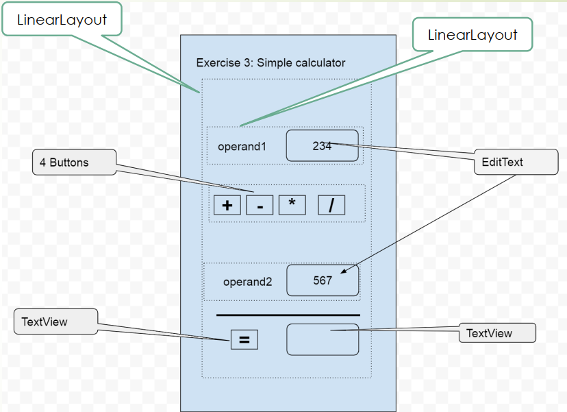

# Calculator app builded over given layout and Kotlin

### First task was to analyze an order of events on the screen

|   | First Time | Back | Home | Rotate |
| - | - | - | - | - |
| onCreate |   |   |   |   |
| onStart | 1 |   |   | 4 |
| onSaveInstanceState |   |   |   |   |
| onResume | 2 |   |   | 6 |
| onPause |   | 1 | 1 | 1 |
| onStop |   | 2 | 2 | 2 |
| onRestoreInstanceState |   |   |   | 5 |
| onDestroy |   | 3 |   | 3 |

### Second task is to build a calculator

The given layout is pretty simple and has only 4 operators, but it was quite exsiting expirience and next step is to build a real beautiful calculator application

